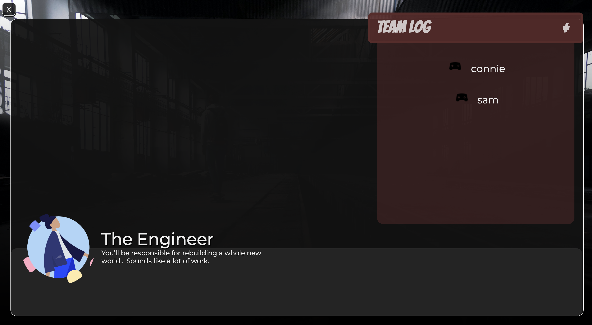

# Surviral with JANEbox Games

## Project Description
This project is a multiplayer, storyline game that allows players to work together and defeat a viral enemy and save the world! This project was built as part of the mintbean.io Multiplayer Game Hackathon to build a multiplayer, turn-based online game.

This is the server-side repo which uses Socket.io, Express, and Node to create the server-side functionality. Please check out our [Client Repo](https://github.com/connietran-dev/janebox-surviral-client) for the inspiration and details behind this game.

## Project Links
* [Deployed Client](https://connietran-dev.github.io/janebox-surviral-client)
* [Deployed Server](https://surviral-server.herokuapp.com/)
* [Client Repo](https://github.com/connietran-dev/janebox-surviral-client)

## Game Screenshots

## Dependencies
* [Socket.io](https://socket.io/)
* [Express.js](https://expressjs.com/)
* [NodeJS](https://nodejs.org/es/)
* [Heroku](https://www.heroku.com/)

### Relevant Scripts
* `npm start` (runs server.js)

## Wireframes

## Authors

* **Samantha Sexton**: Full stack web development, React, Sass, socket.io, wireframing - [@srsexton94](https://github.com/srsexton94)
* **Connie Tran**: Full stack web development, socket.io, Express, Node, React - [@connietran-dev](https://github.com/connietran-dev)
* **Nick Morgan**: Story development
